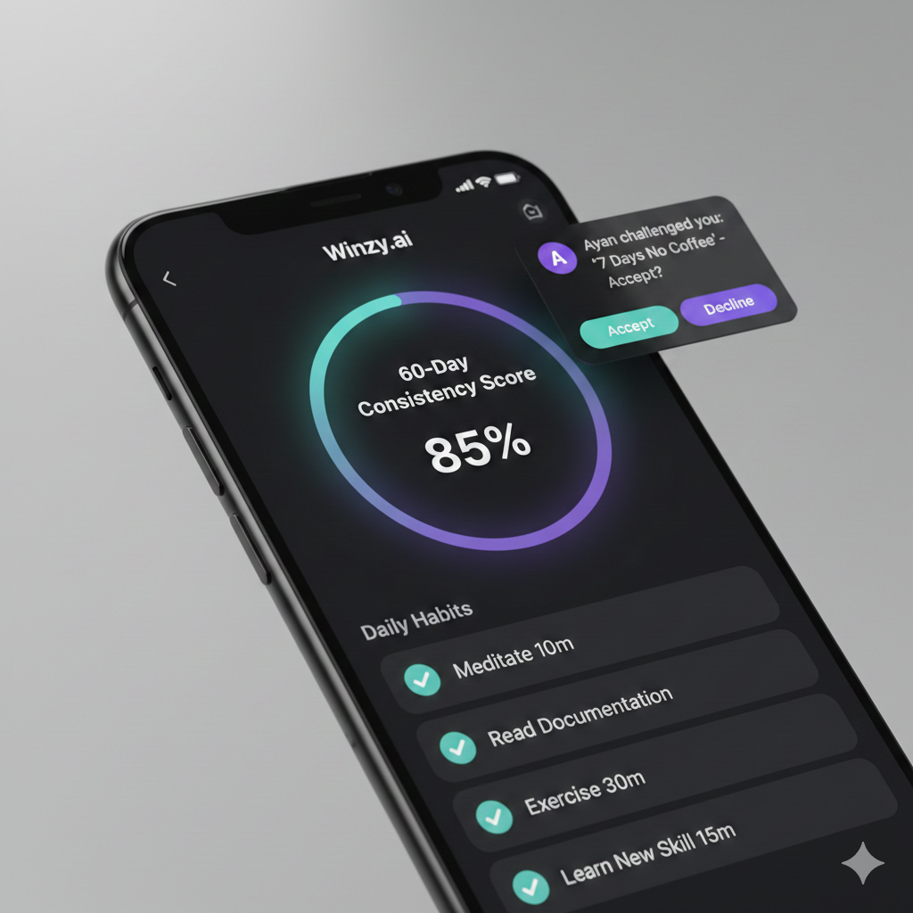
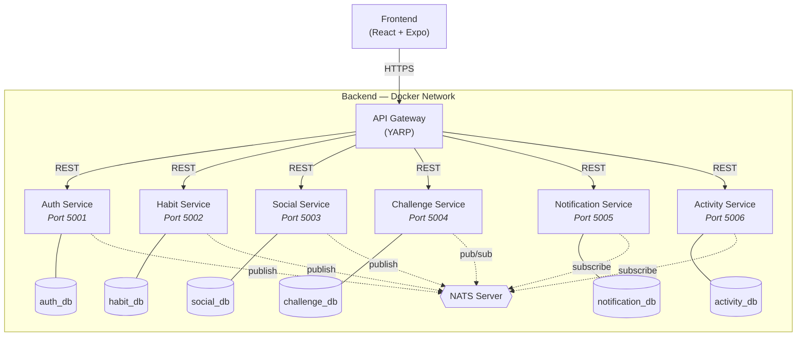
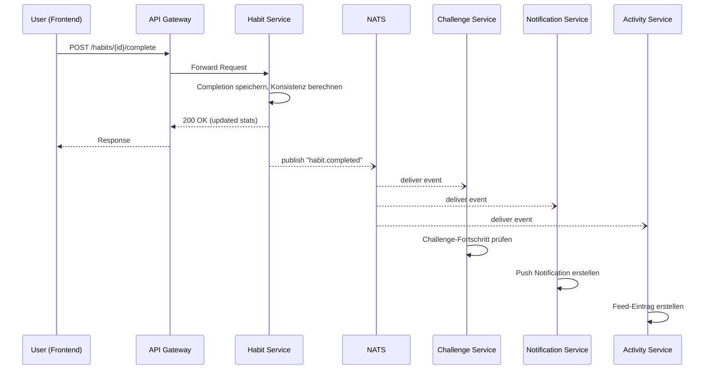

# M321-LB2: Konzeptdokument — Winzy.ai

**Modul:** M321 — Verteilte Systeme
**Gruppe:** Ayan Qazi, Raphael Hof, Gabriel Listiak
**Datum:** 18.02.2026

---

## 1. Projektbeschreibung



Winzy.ai ist ein Habit Tracker mit optionalem sozialem Layer. Die App ermöglicht es Nutzern, tägliche Gewohnheiten zu verfolgen, und bietet eine soziale Schicht, über die Freunde den Fortschritt sehen und sich gegenseitig mit erlebnisbasierten Challenges motivieren können.

**Kernprinzipien:**
- **Habit Tracker first** — funktioniert als eigenständiger Tracker ohne soziale Features
- **Sozialer Layer ist optional** — Freunde können Fortschritte sehen und Challenges setzen
- **Konsistenz statt Streaks** — 60-Tage Rolling Window statt Alles-oder-Nichts-Streaks
- **Shared Experiences** — Challenge-Belohnungen sind gemeinsame Erlebnisse (Kaffee trinken, Tennis spielen), keine materiellen Geschenke

### Warum Microservices?

Das Projekt eignet sich hervorragend für eine Microservices-Architektur, da es aus klar abgrenzbaren Domänen besteht, die unabhängig voneinander entwickelt und skaliert werden können:

- **Klare Domain-Boundaries:** Habits, Freundschaften, Challenges und Notifications sind eigenständige Fachbereiche mit wenig überlappenden Datenmodellen.
- **Unabhängige Skalierbarkeit:** Der Habit Service wird am häufigsten aufgerufen (mehrmals täglich pro User), während der Challenge Service deutlich weniger Last verarbeitet.
- **Team-Parallelisierung:** Drei Entwickler können parallel an verschiedenen Services arbeiten, ohne sich gegenseitig zu blockieren.
- **Event-Driven Natur:** Viele Features sind reaktiv — ein Habit-Completion triggert Notifications, Feed-Updates und Challenge-Fortschritt. Pub/Sub ist das natürliche Pattern dafür.

---

## 2. Architektur

### 2.1 Übersicht

Die Applikation besteht aus 7 Services (6 Domain-Services + 1 Gateway). Das Frontend kommuniziert ausschliesslich über das API Gateway mit den Backend-Services. Intern kommunizieren die Services auf zwei Wegen: synchron via REST für direkte Abfragen und asynchron via NATS Pub/Sub für Events.




### 2.2 Event-Flow (Pub/Sub)

Das folgende Diagramm zeigt, wie ein einzelnes Event (`habit.completed`) durch das System fliesst und mehrere Reaktionen auslöst:



### 2.3 Microservices im Detail

| # | Service | Verantwortung | Datenbank | Port |
|---|---------|---------------|-----------|------|
| 1 | **API Gateway** | Routing, JWT-Validierung, Rate Limiting | — | 5000 |
| 2 | **Auth Service** | Registrierung, Login, JWT, Profilverwaltung | auth_db | 5001 |
| 3 | **Habit Service** | Habit CRUD, Completions, Konsistenz-Berechnung | habit_db | 5002 |
| 4 | **Social Service** | Freundschaften, Sichtbarkeitsregeln | social_db | 5003 |
| 5 | **Challenge Service** | Challenges, Meilensteine, Fortschritt | challenge_db | 5004 |
| 6 | **Notification Service** | Push-Notifications, Erinnerungen | notification_db | 5005 |
| 7 | **Activity Service** | Activity Feed, Event-Aggregation | activity_db | 5006 |

---

#### API Gateway (YARP)

Der einzige öffentlich erreichbare Endpunkt. Alle Client-Anfragen laufen durch das Gateway, das folgende Aufgaben übernimmt:

- **Routing:** Leitet Anfragen basierend auf dem URL-Pfad an den zuständigen Service weiter (`/auth/*` → Auth Service, `/habits/*` → Habit Service, etc.)
- **JWT-Validierung:** Prüft das Bearer-Token bei geschützten Endpoints und injiziert die User-ID als Header für downstream Services
- **Rate Limiting:** Schützt die Services vor Überlastung
- **Health Aggregation:** Sammelt Health-Check-Responses aller Services unter `/health`

---

#### Auth Service

Verwaltet Benutzerkonten und Authentifizierung. Stellt JWT-Tokens aus, die vom Gateway bei jedem Request validiert werden.

| Method | Endpoint | Beschreibung |
|--------|----------|-------------|
| POST | `/auth/register` | Konto erstellen |
| POST | `/auth/login` | Einloggen, JWT + Refresh Token erhalten |
| POST | `/auth/refresh` | Access Token erneuern |
| GET | `/auth/profile` | Eigenes Profil abrufen |
| PUT | `/auth/profile` | Profil bearbeiten (Name, Avatar) |
| PUT | `/auth/password` | Passwort ändern |

**Publizierte Events:**
| Event | Payload | Beschreibung |
|-------|---------|-------------|
| `user.registered` | `{ userId, username }` | Neuer User registriert |

---

#### Habit Service

Kernservice der Applikation. Verwaltet Habits und deren Completions. Berechnet die Konsistenz über ein **60-Tage Rolling Window** — ein Ansatz der Fortschritt würdigt statt Perfektion zu verlangen. Selbst nach einem verpassten Tag bleibt die Konsistenz sichtbar, anstatt auf Null zurückzufallen.

| Method | Endpoint | Beschreibung |
|--------|----------|-------------|
| POST | `/habits` | Neues Habit erstellen |
| GET | `/habits` | Eigene Habits abrufen |
| GET | `/habits/{id}` | Habit-Details inkl. Statistiken |
| PUT | `/habits/{id}` | Habit bearbeiten |
| DELETE | `/habits/{id}` | Habit löschen |
| POST | `/habits/{id}/complete` | Habit als erledigt markieren |
| GET | `/habits/{id}/stats` | Detaillierte Statistiken (Konsistenz, Kalender) |
| GET | `/habits/user/{userId}` | Habits eines Users abrufen (intern, für Social Service) |

**Publizierte Events:**
| Event | Payload | Beschreibung |
|-------|---------|-------------|
| `habit.completed` | `{ userId, habitId, date, consistency }` | Habit abgeschlossen |
| `habit.created` | `{ userId, habitId, name }` | Neues Habit erstellt |

---

#### Social Service

Verwaltet Freundschaftsbeziehungen und Sichtbarkeitsregeln. Wenn ein User die Habits eines Freundes sehen will, prüft der Social Service die Berechtigung und ruft dann den Habit Service intern auf.

| Method | Endpoint | Beschreibung |
|--------|----------|-------------|
| POST | `/friends/request` | Freundschaftsanfrage senden |
| PUT | `/friends/request/{id}/accept` | Anfrage annehmen |
| PUT | `/friends/request/{id}/decline` | Anfrage ablehnen |
| DELETE | `/friends/{id}` | Freund entfernen |
| GET | `/friends` | Freundesliste abrufen |
| GET | `/friends/{id}/profile` | Freundesprofil + sichtbare Habits |
| PUT | `/habits/{id}/visibility` | Sichtbarkeit eines Habits einstellen |

> **Cross-Service Kommunikation:** `GET /friends/{id}/profile` prüft zuerst die Freundschaft und Sichtbarkeitsregeln in der eigenen DB, ruft dann intern `GET /habits/user/{userId}` auf dem Habit Service auf und filtert die Ergebnisse nach den Sichtbarkeitseinstellungen.

**Publizierte Events:**
| Event | Payload | Beschreibung |
|-------|---------|-------------|
| `friend.request.sent` | `{ fromUserId, toUserId }` | Anfrage gesendet |
| `friend.request.accepted` | `{ userId1, userId2 }` | Freundschaft bestätigt |

---

#### Challenge Service

Ermöglicht Freunden, sich gegenseitig herauszufordern. Challenges basieren auf Meilensteinen (z.B. "7 Tage am Stück meditieren") und belohnen mit gemeinsamen Erlebnissen (z.B. zusammen Kaffee trinken gehen). Hört auf `habit.completed`-Events um den Fortschritt automatisch zu aktualisieren.

| Method | Endpoint | Beschreibung |
|--------|----------|-------------|
| POST | `/challenges` | Challenge erstellen |
| GET | `/challenges` | Eigene Challenges (gesendet + empfangen) |
| GET | `/challenges/{id}` | Challenge-Details + Fortschritt |
| PUT | `/challenges/{id}/claim` | Belohnung als eingelöst markieren |
| DELETE | `/challenges/{id}` | Challenge abbrechen |

**Abonnierte Events:**
| Event | Reaktion |
|-------|----------|
| `habit.completed` | Challenge-Fortschritt aktualisieren, bei Erreichen des Meilensteins `challenge.completed` publizieren |

**Publizierte Events:**
| Event | Payload | Beschreibung |
|-------|---------|-------------|
| `challenge.created` | `{ challengeId, fromUser, toUser, habitId }` | Neue Challenge |
| `challenge.completed` | `{ challengeId, userId, reward }` | Meilenstein erreicht |

---

#### Notification Service

Konsumiert Events aller Services und erstellt daraus Push-Benachrichtigungen. Verwaltet die Zustellung und Lesebestätigungen.

| Method | Endpoint | Beschreibung |
|--------|----------|-------------|
| GET | `/notifications` | Eigene Benachrichtigungen (paginiert) |
| PUT | `/notifications/{id}/read` | Als gelesen markieren |
| PUT | `/notifications/read-all` | Alle als gelesen markieren |
| GET | `/notifications/unread-count` | Anzahl ungelesener Notifications |
| PUT | `/notifications/settings` | Benachrichtigungspräferenzen ändern |

**Abonnierte Events:**
| Event | Notification |
|-------|-------------|
| `habit.completed` | Freunde informieren (falls gewünscht) |
| `friend.request.sent` | "X möchte dich als Freund hinzufügen" |
| `friend.request.accepted` | "Y hat deine Anfrage angenommen" |
| `challenge.created` | "X hat dich herausgefordert: ..." |
| `challenge.completed` | "Du hast die Challenge geschafft!" |

---

#### Activity Service

Aggregiert Events zu einem chronologischen Activity Feed. Zeigt Nutzern, was in ihrem Freundeskreis passiert.

| Method | Endpoint | Beschreibung |
|--------|----------|-------------|
| GET | `/feed` | Eigener Feed (paginiert, nur sichtbare Aktivitäten) |

**Abonnierte Events:**
| Event | Feed-Eintrag |
|-------|-------------|
| `user.registered` | "X ist Winzy.ai beigetreten" |
| `habit.created` | "X hat ein neues Habit gestartet: Meditation" |
| `habit.completed` | "X hat heute Meditation abgeschlossen" |
| `friend.request.accepted` | "X und Y sind jetzt Freunde" |
| `challenge.created` | "X hat Y herausgefordert" |
| `challenge.completed` | "Y hat die Challenge geschafft!" |

---

### 2.4 Kommunikation

#### Synchron — REST via HTTP

- **Client → Gateway → Service:** Alle externen Anfragen laufen durch das Gateway.
- **Service → Service (intern):** Direkte HTTP-Aufrufe über das Docker-Netzwerk, z.B. Social Service → Habit Service. Werden nur verwendet, wenn ein Service Daten eines anderen braucht, um seinen eigenen Response zu bauen.

#### Asynchron — NATS Pub/Sub

Für Event-basierte Kommunikation. Publisher und Subscriber sind vollständig entkoppelt — der Habit Service weiss nicht, wer auf `habit.completed` reagiert.

| Event | Publisher | Subscriber |
|-------|-----------|------------|
| `user.registered` | Auth Service | Activity |
| `habit.created` | Habit Service | Activity |
| `habit.completed` | Habit Service | Challenge, Notification, Activity |
| `friend.request.sent` | Social Service | Notification |
| `friend.request.accepted` | Social Service | Notification, Activity |
| `challenge.created` | Challenge Service | Notification, Activity |
| `challenge.completed` | Challenge Service | Notification, Activity |

### 2.5 Service Discovery & Networking

Alle Services laufen als Container im selben **Docker Compose Netzwerk**. Service Discovery erfolgt über Docker DNS — jeder Service ist unter seinem Container-Namen erreichbar (z.B. `http://habit-service:5002`).

Die Service-URLs werden über **Environment Variables** konfiguriert, was einen späteren Wechsel zu Kubernetes oder einem Service Mesh ermöglicht, ohne Code-Änderungen.

### 2.6 Datenbank-Strategie

Jeder Service besitzt seine eigene PostgreSQL-Datenbank (**Database-per-Service Pattern**):

- **Datenhoheit:** Jeder Service ist der einzige Owner seiner Daten. Kein anderer Service greift direkt auf eine fremde DB zu.
- **Unabhängige Schemas:** Schema-Änderungen in einem Service können keine anderen Services brechen.
- **Unabhängiges Deployment:** Services können einzeln deployed, migriert und skaliert werden.

In der lokalen Entwicklung laufen alle Datenbanken als separate PostgreSQL-Container, verwaltet durch Docker Compose.

### 2.7 Health Checks & Observability

Jeder Service implementiert einen `GET /health`-Endpoint, der Folgendes zurückgibt:
- Status des Services (UP/DOWN)
- Datenbank-Konnektivität
- NATS-Verbindungsstatus

Das API Gateway aggregiert die Health-Checks aller Services unter `GET /health` und gibt eine Gesamtübersicht des Systems zurück.

---

## 3. Technologien

| Komponente | Technologie | Begründung |
|------------|-------------|------------|
| **Frontend** | React + Expo | Cross-Platform (Web, iOS, Android) aus einer Codebase. PWA-fähig für "Add to Home Screen" ohne App Store. Grosse Community und bewährtes Ökosystem. |
| **Backend** | .NET 10 Minimal APIs (C#) | Hohe Performance (einer der schnellsten Web-Frameworks laut TechEmpower Benchmarks), starke Typsicherheit durch C#, erstklassiges Tooling (Visual Studio, Rider). Minimal APIs reduzieren Boilerplate und eignen sich ideal für schlanke Microservices. |
| **Datenbank** | PostgreSQL | Open-source, ACID-compliant, exzellente Performance bei komplexen Queries. Starke JSON-Unterstützung (`jsonb`) für flexible Datenstrukturen. Bewährt in der Industrie mit grosser Community. |
| **ORM** | Entity Framework Core | Standard-ORM im .NET-Ökosystem. Code-First Migrations ermöglichen versionierte Schema-Änderungen, LINQ bietet typsichere Queries. |
| **Message Broker** | NATS | Cloud-native Messaging-System mit extrem niedriger Latenz (~0.1ms). Leichtgewichtiger als RabbitMQ und Kafka, einfach zu konfigurieren, ideal für Event-Driven Microservices. JetStream bietet bei Bedarf persistente Messaging. |
| **API Gateway** | YARP | Von Microsoft entwickelter Reverse Proxy, nahtlose Integration in .NET. Konfigurierbar via Code oder JSON, unterstützt Load Balancing und Health Checks out-of-the-box. |
| **Auth** | JWT (JSON Web Tokens) | Stateless Authentication — ideal für Microservices, da kein zentraler Session Store nötig. Token wird einmal vom Auth Service ausgestellt und vom Gateway bei jedem Request validiert. |
| **Containerisierung** | Docker + Docker Compose | Jeder Service als isolierter Container. Docker Compose orchestriert die gesamte Entwicklungsumgebung (7 Services + 6 DBs + NATS) mit einem einzigen `docker compose up`. Garantiert identische Umgebungen für alle Teammitglieder. |
| **CI/CD** | GitHub Actions | Automatisierte Builds, Linting und Tests bei jedem Push. Pro Service ein eigener Workflow, sodass nur betroffene Services gebaut und getestet werden. |
| **Versionskontrolle** | Git + GitHub | Mono-Repo mit klarer Ordnerstruktur pro Service. Feature Branches, Pull Requests mit Code Reviews, geschützter `main`-Branch. |

---

## 4. Planung

### 4.1 Verantwortung

Jede Person ist Owner ihrer Services und verantwortlich für Implementierung, Tests und Dokumentation.

| Person | Services | Beschreibung |
|--------|----------|--------------|
| **Gabriel Listiak** | API Gateway, Auth Service, Habit Service | Kerninfrastruktur: Gateway-Routing, Authentifizierung und der zentrale Habit-Service. Bildet das Fundament, auf dem die anderen Services aufbauen. |
| **Ayan Qazi** | Social Service, Challenge Service | Sozialer Layer: Freundschaftssystem und Challenge-Mechanik. Baut auf Auth und Habit Service auf. |
| **Raphael Hof** | Notification Service, Activity Service, Frontend-Integration | Event-Konsumenten: Verarbeitet Events zu Notifications und Activity Feed. Verantwortlich für die Anbindung des Frontends an die Backend-API. |

**Gemeinsame Aufgaben:**
- Docker Compose Setup und Pflege
- CI/CD Pipeline (GitHub Actions)
- Code Reviews via Pull Requests
- NATS Event-Schema Definition (gemeinsames Contracts-Projekt)
- Integrationstests zwischen Services

### 4.2 Priorisierung

Bei (Teil-)Ausfall eines Gruppenmitglieds wird nach folgender Priorität entschieden:

| Priorität | Services | Begründung |
|-----------|----------|------------|
| **P0 — Must Have** | API Gateway, Auth Service, Habit Service | Die App muss mindestens als Standalone-Tracker funktionieren. Ohne diese Services ist nichts lauffähig. |
| **P1 — Should Have** | Social Service, Challenge Service | Kern des sozialen Layers. Macht Winzy.ai einzigartig, die App funktioniert aber auch ohne. |
| **P2 — Nice to Have** | Notification Service, Activity Service | Verbessern die UX erheblich, sind aber nicht funktionskritisch. |

**Szenario: Ein Mitglied fällt komplett aus**
- P2-Services werden gestrichen oder auf Minimalversion reduziert
- Verbleibende Mitglieder übernehmen je einen P1-Service zusätzlich

**Szenario: Ein Mitglied fällt teilweise aus**
- Betroffene Person fokussiert auf die kritischsten Teile ihrer Services
- Weniger wichtige Features innerhalb eines Service werden zurückgestellt

### 4.3 IPA-Abwesenheiten

Alle Gruppenmitglieder absolvieren ihre Individuelle Praktische Arbeit (IPA). Während dieser Zeiträume ist die Produktivität am Projekt stark eingeschränkt.

| Person | IPA-Zeitraum | Betroffene Phase(n) |
|--------|-------------|---------------------|
| **Gabriel Listiak** | 09.03. – 28.03.2026 | Phase 1 (letzte Woche), Phase 2 (Beginn) |
| **Ayan Qazi** | 16.03. – 31.03.2026 | Phase 2 (Beginn) |
| **Raphael Hof** | 16.04. – 30.04.2026 | Phase 3 (erste Hälfte) |

> **Strategie:** Die Meilensteine sind so geplant, dass in jeder Phase mindestens ein Teammitglied voll verfügbar ist. Aufgaben werden während IPA-Zeiten bewusst auf die verfügbaren Mitglieder umverteilt.

### 4.4 Meilensteine

| Phase | Deadline | Ziel | Verfügbarkeit |
|-------|----------|------|---------------|
| **Phase 0: Foundation** | 15.02.2026 | Projektstruktur, Tooling, Docker Compose, CI/CD, leere Service-Projekte | Alle verfügbar |
| **Phase 1: Habit Tracker** | 08.03.2026 | Auth Service, Habit Service, Gateway. App funktioniert als eigenständiger Tracker. | Alle verfügbar (Gabriel ab 09.03 in IPA) |
| **Phase 2: Social** | 19.04.2026 | Social Service, Freundschaftssystem, Sichtbarkeit, NATS Events. | Raphael treibt voran. Gabriel ab 28.03 und Ayan ab 31.03 wieder verfügbar. |
| **Phase 3: Challenges** | 10.05.2026 | Challenge Service, Challenge-Erstellung, Fortschritt-Tracking, Abschluss-Flow. | Gabriel + Ayan treiben voran. Raphael ab 16.04 in IPA. |
| **Phase 4: Enhancements** | 03.06.2026 | Notification Service, Activity Service, Polish, Testing, Dokumentation. | Alle verfügbar (Raphael ab 01.05 zurück) |
| **Phase 5: AI** | TBD | KI-basierte Features (Habit-Vorschläge, Smart Reminders). | Alle verfügbar |

```
Timeline 2026
═══════════════════════════════════════════════════════════════════════════
Feb         März              April              Mai              Juni
├───────────┼─────────────────┼──────────────────┼────────────────┼──────
│  Phase 0  │    Phase 1      │     Phase 2      │   Phase 3      │ Ph.4
│  ██████   │  ██████████████ │ ████████████████ │ ██████████████ │ █████
│           │                 │                  │                │
│           │  ░░░░░░░░░░░░░░░░░░░  Gabriel IPA  │                │
│           │     09.03 ──────── 28.03            │                │
│           │                 │                  │                │
│           │       ░░░░░░░░░░░░░  Ayan IPA      │                │
│           │       16.03 ─────── 31.03           │                │
│           │                 │                  │                │
│           │                 │    ░░░░░░░░░░░░░░░  Raphael IPA   │
│           │                 │    16.04 ─────── 30.04            │
═══════════════════════════════════════════════════════════════════════════
```

---

## 5. Arbeitsplattform

| Tool | Zweck |
|------|-------|
| **GitHub** | Mono-Repo, Issues, Pull Requests, Code Reviews, Milestones |
| **GitHub Actions** | CI/CD: Build, Lint, Tests pro Service bei jedem Push |
| **GitHub Projects** | Kanban-Board für Aufgabenverwaltung und Sprint-Planung |
| **Docker + Docker Compose** | Lokale Entwicklungsumgebung — `docker compose up` startet das gesamte System |
| **Discord** | Tägliche Kommunikation und schnelle Abstimmung |
