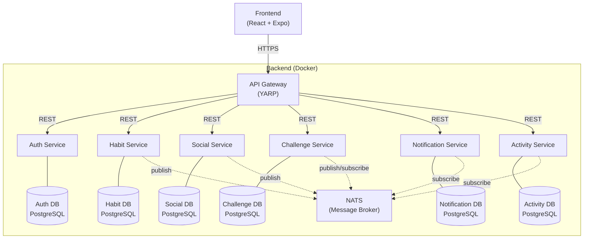

# M321-LB2: Konzeptdokument — Winzy.ai

**Modul:** M321 — Verteilte Systeme
**Gruppe:** Ayan Qazi, Raphael Hof, Gabriel Listiak
**Datum:** 18.02.2026

---

## 1. Projektbeschreibung

Winzy.ai ist ein Habit Tracker mit optionalem sozialem Layer. Die App ermöglicht es Nutzern, tägliche Gewohnheiten zu verfolgen, und bietet eine soziale Schicht, über die Freunde den Fortschritt sehen und sich gegenseitig mit erlebnisbasierten Challenges motivieren können.

**Kernprinzipien:**
- Habit Tracker first — funktioniert als eigenständiger Tracker ohne soziale Features
- Sozialer Layer ist optional — Freunde können Fortschritte sehen und Challenges setzen
- Konsistenz statt Streaks — 60-Tage Rolling Window statt Alles-oder-Nichts-Streaks

---

## 2. Architektur

### 2.1 Übersicht

Die Applikation ist als Microservices-Architektur aufgebaut. Das Frontend kommuniziert ausschliesslich über ein API Gateway mit den Backend-Services. Die Services kommunizieren untereinander synchron via REST und asynchron via NATS Pub/Sub.

### 2.2 Microservices

Die Applikation besteht aus **7 Services** (6 Domain-Services + 1 Gateway):

| # | Service | Verantwortung | Datenbank |
|---|---------|---------------|-----------|
| 1 | **API Gateway** | Zentraler Einstiegspunkt, Routing, JWT-Validierung, Rate Limiting | — |
| 2 | **Auth Service** | Registrierung, Login, Token-Erstellung, Passwort-Reset, Profilverwaltung | Auth DB |
| 3 | **Habit Service** | Habit CRUD, Completions erfassen, Konsistenz-Berechnung (60-Tage-Fenster) | Habit DB |
| 4 | **Social Service** | Freundschaftsanfragen, Freundesliste, Sichtbarkeitseinstellungen pro Habit | Social DB |
| 5 | **Challenge Service** | Challenge erstellen, Fortschritt tracken, Meilensteine, Abschluss erkennen | Challenge DB |
| 6 | **Notification Service** | Push-Benachrichtigungen, Erinnerungen, Friend/Challenge-Updates | Notification DB |
| 7 | **Activity Service** | Activity Feed aggregieren, Events von anderen Services sammeln und darstellen | Activity DB |

#### API Gateway (YARP)

Das Gateway ist der einzige öffentlich erreichbare Endpunkt. Es leitet Anfragen an die zuständigen Services weiter, validiert JWT-Tokens und implementiert Rate Limiting. YARP (Yet Another Reverse Proxy) von Microsoft integriert sich nahtlos in .NET.

#### Auth Service

Verwaltet Benutzerkonten und Authentifizierung. Stellt JWT-Tokens aus, die von allen anderen Services über das Gateway validiert werden. Speichert Benutzerprofile (Name, Avatar, E-Mail).

**Endpoints:**
- `POST /auth/register` — Neues Konto erstellen
- `POST /auth/login` — Einloggen, JWT erhalten
- `POST /auth/refresh` — Token erneuern
- `GET /auth/profile` — Eigenes Profil abrufen
- `PUT /auth/profile` — Profil bearbeiten

#### Habit Service

Kernservice der Applikation. Verwaltet Habits und deren Completions. Berechnet die Konsistenz über ein 60-Tage Rolling Window (statt klassischer Streaks).

**Endpoints:**
- `POST /habits` — Neues Habit erstellen
- `GET /habits` — Eigene Habits abrufen
- `PUT /habits/{id}` — Habit bearbeiten
- `DELETE /habits/{id}` — Habit löschen
- `POST /habits/{id}/complete` — Habit als erledigt markieren
- `GET /habits/{id}/stats` — Statistiken abrufen

**Events (publish via NATS):**
- `habit.completed` — Wenn ein Habit abgeschlossen wird
- `habit.created` — Wenn ein neues Habit erstellt wird

#### Social Service

Verwaltet Freundschaftsbeziehungen und Sichtbarkeitsregeln. Andere Services fragen den Social Service, ob ein Nutzer berechtigt ist, die Habits eines anderen zu sehen.

**Endpoints:**
- `POST /friends/request` — Freundschaftsanfrage senden
- `PUT /friends/request/{id}/accept` — Anfrage annehmen
- `PUT /friends/request/{id}/decline` — Anfrage ablehnen
- `DELETE /friends/{id}` — Freund entfernen
- `GET /friends` — Freundesliste abrufen
- `GET /friends/{id}/habits` — Sichtbare Habits eines Freundes

**Events (publish via NATS):**
- `friend.request.sent` — Freundschaftsanfrage gesendet
- `friend.request.accepted` — Anfrage angenommen

#### Challenge Service

Ermöglicht Freunden, sich gegenseitig herauszufordern. Challenges basieren auf Meilensteinen (z.B. "7 Tage am Stück meditieren") und belohnen mit gemeinsamen Erlebnissen (z.B. zusammen Kaffee trinken gehen).

**Endpoints:**
- `POST /challenges` — Challenge erstellen
- `GET /challenges` — Eigene Challenges abrufen
- `GET /challenges/{id}` — Challenge-Details
- `PUT /challenges/{id}/claim` — Belohnung einlösen

**Events (subscribe via NATS):**
- Hört auf `habit.completed` um Challenge-Fortschritt zu aktualisieren

**Events (publish via NATS):**
- `challenge.created` — Neue Challenge erstellt
- `challenge.completed` — Challenge abgeschlossen

#### Notification Service

Sammelt Events von allen Services und versendet Push-Benachrichtigungen an die Nutzer. Verwaltet Benachrichtigungspräferenzen.

**Events (subscribe via NATS):**
- `habit.completed`, `friend.request.sent`, `friend.request.accepted`, `challenge.created`, `challenge.completed`

#### Activity Service

Aggregiert Events zu einem chronologischen Activity Feed. Zeigt Freunden, was in ihrem Netzwerk passiert.

**Endpoints:**
- `GET /feed` — Eigener Activity Feed

**Events (subscribe via NATS):**
- Alle relevanten Events (`habit.completed`, `challenge.created`, `challenge.completed`, etc.)

### 2.3 Kommunikation

Die Services kommunizieren auf zwei Arten:

**Synchron (REST via HTTP):**
- Frontend → API Gateway → Service
- Für direkte Request/Response-Interaktionen (z.B. Habit erstellen, Freundesliste abrufen)
- Das API Gateway routet basierend auf dem URL-Pfad zum richtigen Service

**Asynchron (NATS Pub/Sub):**
- Service → NATS → Subscriber-Services
- Für Event-basierte Kommunikation (z.B. "Habit abgeschlossen" löst Notification und Feed-Update aus)
- Lose Kopplung: Publisher kennt seine Subscriber nicht

| Event | Publisher | Subscriber |
|-------|-----------|------------|
| `habit.completed` | Habit Service | Challenge, Notification, Activity |
| `habit.created` | Habit Service | Activity |
| `friend.request.sent` | Social Service | Notification |
| `friend.request.accepted` | Social Service | Notification, Activity |
| `challenge.created` | Challenge Service | Notification, Activity |
| `challenge.completed` | Challenge Service | Notification, Activity |

### 2.4 Datenbank-Strategie

Jeder Service besitzt seine eigene PostgreSQL-Datenbank. Dies gewährleistet:
- **Unabhängigkeit:** Services können unabhängig deployed und skaliert werden
- **Datenhoheit:** Jeder Service ist der einzige Owner seiner Daten
- **Technologiefreiheit:** Theoretisch könnte jeder Service eine andere DB nutzen

In der lokalen Entwicklung laufen alle PostgreSQL-Instanzen als separate Docker-Container.

---

## 3. Technologien

| Komponente | Technologie | Begründung |
|------------|-------------|------------|
| **Frontend** | React + Expo | Cross-Platform (Web, iOS, Android) aus einer Codebase. PWA-fähig für "Add to Home Screen". |
| **Backend** | .NET 10 Minimal APIs (C#) | Performant, typsicher, hervorragendes Tooling. Minimal APIs reduzieren Boilerplate gegenüber klassischen Controllern. |
| **Datenbank** | PostgreSQL | Bewährt, open-source, starke Unterstützung für JSON-Daten und komplexe Queries. |
| **ORM** | Entity Framework Core | Standard-ORM für .NET. Code-First Migrations, LINQ-Queries, starke Community. |
| **Message Broker** | NATS | Leichtgewichtig, cloud-native, extrem performant. Einfacher aufzusetzen als RabbitMQ/Kafka, ideal für Event-Driven Architecture. |
| **API Gateway** | YARP | Von Microsoft entwickelter Reverse Proxy. Native .NET-Integration, konfigurierbar via Code oder JSON. |
| **Auth** | JWT (JSON Web Tokens) | Stateless Authentication, ideal für Microservices. Token wird einmal vom Auth Service ausgestellt und vom Gateway validiert. |
| **Containerisierung** | Docker + Docker Compose | Jeder Service läuft in seinem eigenen Container. Docker Compose orchestriert alle Services für die lokale Entwicklung. |
| **Versionskontrolle** | Git + GitHub | Branching-Strategie, Pull Requests, Code Reviews, GitHub Actions für CI/CD. |

---

## 4. Planung

### 4.1 Verantwortung

Die Services werden gleichmässig auf die drei Gruppenmitglieder verteilt. Jede Person ist Owner ihrer Services und verantwortlich für Implementierung, Tests und Dokumentation.

| Person | Services | Beschreibung |
|--------|----------|--------------|
| **Gabriel Listiak** | API Gateway, Auth Service, Habit Service | Kerninfrastruktur: Gateway-Routing, Authentifizierung und der zentrale Habit-Service. Bildet das Fundament, auf dem die anderen Services aufbauen. |
| **Ayan Qazi** | Social Service, Challenge Service | Sozialer Layer: Freundschaftssystem und Challenge-Mechanik. Baut auf Auth und Habit Service auf. |
| **Raphael Hof** | Notification Service, Activity Service, Frontend-Integration | Event-Konsumenten: Verarbeitet Events der anderen Services zu Benachrichtigungen und Activity Feed. Bindet das Frontend an die API an. |

**Gemeinsame Aufgaben:**
- Docker Compose Setup
- CI/CD Pipeline (GitHub Actions)
- Code Reviews via Pull Requests
- NATS Event-Schema Definition

### 4.2 Priorisierung

Nicht alle Services sind gleich kritisch. Bei (Teil-)Ausfall eines Gruppenmitglieds wird nach folgender Priorität entschieden:

| Priorität | Services | Status |
|-----------|----------|--------|
| **P0 — Must Have** | API Gateway, Auth Service, Habit Service | Ohne diese funktioniert nichts. Die App muss mindestens als Standalone-Tracker funktionieren. |
| **P1 — Should Have** | Social Service, Challenge Service | Kern des sozialen Layers. Macht die App einzigartig, ist aber nicht überlebensnotwendig. |
| **P2 — Nice to Have** | Notification Service, Activity Service | Verbessern die UX, sind aber nicht funktionskritisch. Können als letztes implementiert werden. |

**Szenario: Ein Mitglied fällt aus**
- P2-Services werden gestrichen oder stark vereinfacht
- Verbleibende Mitglieder übernehmen je einen P1-Service zusätzlich

**Szenario: Ein Mitglied fällt teilweise aus**
- P2-Services werden reduziert (z.B. nur Notifications, kein Feed)
- Betroffene Person fokussiert auf die kritischsten Teile ihrer Services

### 4.3 IPA-Abwesenheiten

Alle Gruppenmitglieder absolvieren in den kommenden Wochen ihre Individuelle Praktische Arbeit (IPA). Während dieser Zeiträume ist die Produktivität am Projekt stark eingeschränkt.

| Person | IPA-Zeitraum |
|--------|-------------|
| **Gabriel Listiak** | 09.03. – 28.03.2026 |
| **Ayan Qazi** | 16.03. – 31.03.2026 |
| **Raphael Hof** | 16.04. – 30.04.2026 |

Diese Abwesenheiten sind in den Meilensteinen berücksichtigt.

### 4.4 Meilensteine

| Phase | Deadline | Ziel | Lieferobjekt |
|-------|----------|------|--------------|
| **Phase 0: Foundation** | 15.02.2026 | Projektstruktur, Tooling, Infrastruktur | Repo-Setup, CI/CD, Docker Compose, leere Service-Projekte |
| **Phase 1: Habit Tracker** | 08.03.2026 | Core Habit Tracking — standalone, einwandfreie Experience | Auth Service, Habit Service, Gateway, Frontend-Anbindung. App funktioniert als eigenständiger Tracker. |
| **Phase 2: Social** | 19.04.2026 | Auth, Sync, Freunde, Sichtbarkeit | Social Service, Freundschaftssystem, Sichtbarkeitseinstellungen, NATS Events. *Hinweis: Gabriel und Ayan in IPA, Raphael treibt voran.* |
| **Phase 3: Challenges & Rewards** | 10.05.2026 | Challenges mit erlebnisbasierten Belohnungen | Challenge Service, Challenge-Erstellung, Fortschritt-Tracking, Abschluss-Flow. *Hinweis: Raphael in IPA, Gabriel und Ayan treiben voran.* |
| **Phase 4: Enhancements** | 03.06.2026 | Notifications, Statistiken, Templates | Notification Service, Activity Service, Polish, Testing, Dokumentation |
| **Phase 5: AI** | TBD | KI-basierte Features | Noch zu definieren |

---

## 5. Arbeitsplattform

| Tool | Zweck |
|------|-------|
| **GitHub** | Repository, Issues, Pull Requests, Code Reviews |
| **GitHub Actions** | CI/CD: Build, Lint, Tests bei jedem Push |
| **GitHub Projects** | Kanban-Board für Aufgabenverwaltung |
| **Docker + Docker Compose** | Lokale Entwicklungsumgebung, identisch für alle Mitglieder |
| **Discord** | Kommunikation und schnelle Abstimmung |
